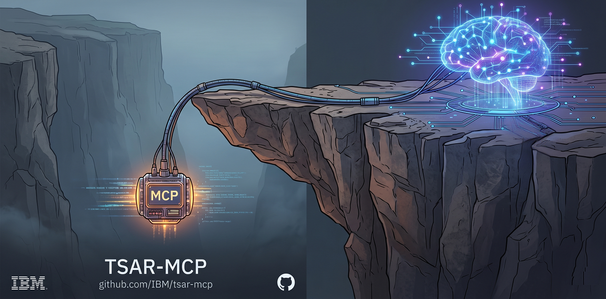

<p align="center">
  
</p>

# TSAR-MCP: Zero-Dependency C Framework for Edge AI

**TSAR** stands for *"Tools Slightly Above the Runtime."* True to that philosophy, this project provides a hyper-lightweight, zero-dependency C framework for building Model Context Protocol (MCP) servers directly on edge, embedded, and enterprise systems. 

While the majority of the AI agent ecosystem relies on heavy runtime environments (Node.js, Python), **TSAR-MCP** is built for extreme efficiency. It compiles to a native binary, consumes virtually zero idle memory, and utilizes standard operating system streams (`stdio` over SSH) for secure, instant LLM-to-system communication.

## Getting Started

### 💡 The "Aha!" Moment: Giving AI Hands

Think of an MCP server as giving an AI mind a set of "hands" to interact with the physical world. While an LLM is normally restricted to its chat window, an MCP server allows it to reach out and do things—like reading a local file, querying a secure database, or checking system hardware.

**Why C? And why is it actually easy?**
Building an integration in native C might sound daunting, but this framework combined with modern AI makes it incredibly simple. You don't even need to write the boilerplate.

**Build your own custom MCP Server in 4 steps:**

1. **Get a compiler:** Use `g++` (available natively on Linux) or Visual Studio Community Edition (free on Windows).
2. **Get Git:** Download from [git-scm.com](https://git-scm.com) or use your package manager (e.g., `sudo apt install git`).
3. **Clone the repository:** Pull the TSAR-MCP framework to your local machine.
   ```bash
   git clone https://github.com/IBM/tsar-mcp.git
   ```
4. **Let the AI write the code:** Open your favorite LLM (Claude, ChatGPT, Gemini), attach the **[`mcp/doc/MCPServer_AspectGuide.md`](./mcp/doc/MCPServer_AspectGuide.md)** file *(true to form, TSAR-MCP was architected so that aspects are easily co-authored by both LLMs and humans)*, and prompt it with what you want:
   > *"Please read this guide and write me a new MCP aspect to read a specified number of lines from any text file and return it to the client."*

The LLM will seamlessly read the architectural rules and generate the exact `.cpp` file you need. Drop it into the directory, run `make`, and your AI now has a brand new set of hands.

---

### 🔌 Wiring it to your AI Client

Once you have compiled your MCP server, you need to connect it to an AI client (like Claude Desktop or VSCode). Because TSAR-MCP uses a strict zero-dependency `stdio` transport model, you can run the server locally or securely across the world over an SSH tunnel.

Read the **[MCPServer Wiring & Transport Guide](./mcp/doc/MCPServer_WiringGuide.md)** to learn how to easily configure your `mcp.json` for local, OpenSSH, or PuTTY/Plink connections.

---

### Building the MCP Framework Manually

If you prefer to manually scaffold your tools or compile the included baseline examples, the core of this framework is designed to be easily extensible. You build new AI capabilities by creating an **aspect**—a single `.cpp` file that defines your tool's personality (name, parameters, and execution logic) while plugging into the underlying native engine. The core framework handles all JSON-RPC parsing, memory management, and standard I/O automatically. 

To learn how to quickly scaffold, build, and test your own custom tools by hand, please read the **[MCPServer Aspect Guide](./mcp/doc/MCPServer_AspectGuide.md)**.

Navigate to the `mcp/` directory. The framework uses an out-of-source build system, placing compiled binaries into the `build/Release` or `build/Debug` directories.

**Linux / macOS (GNU Make):**
```bash
cd mcp
make                 # Builds all aspects (Release mode)
make CFG=Debug       # Builds all aspects (Debug mode)
make helloWorld      # Builds only the helloWorld aspect
make cleanall        # Removes the entire build directory
```

**Windows**

```bash
cd mcp
nmake -f Makefile.nmake                 # Builds all aspects (Release mode)
nmake -f Makefile.nmake CFG=Debug       # Builds all aspects (Debug mode)
nmake -f Makefile.nmake helloWorld      # Builds only the helloWorld aspect
nmake -f Makefile.nmake cleanall        # Removes the entire build directory
```

## Core Architecture

TSAR-MCP leverages a battle-tested, clean-room C runtime and parsing engine to handle JSON-RPC 2.0 traffic natively:

* **Zero-Dependency Transport:** Communicates securely with LLM clients via `ssh -batch`. No sockets, no open web ports, and no custom network code—just OS-level encrypted `stdin/stdout` streams.
* **The `CommonC` Foundation:** A robust, legacy-hardened C runtime handling memory management and string operations without external library bloat.
* **Native BNF Parsing:** High-performance, compiled parsing engine (`JSONParser`) that process LLM payloads with extreme speed and safety.

## Included Examples & Roadmap

This repository includes the core framework alongside target-specific MCP server implementations to demonstrate the extensibility of the architecture:

* **WordArt Generator ([`wordArt`](./mcp/servers/wordArt/MCPServer_wordArt.cpp)):** Demonstrates **bi-directional LLM-code integration** (MCP Sampling). Rather than relying on native C string manipulation, this aspect dynamically prompts the client's LLM (`sampling/createMessage`) to generate styled ASCII art—showcasing the simplicity by which TSAR-MCP bridges the absolute deterministic safety of a native C runtime with the dynamic cognitive reasoning of modern AI.

* **Hello World & Port Scan ([`helloWorld`](./mcp/servers/helloWorld/MCPServer_helloWorld.cpp), [`portScan`](./mcp/servers/portScan/MCPServer_portScan.cpp)):** Basic implementations that demonstrate how to bind standard I/O to the native JSON-RPC parsing engine, and how to interact sequentially with local network sockets.

* **Asynchronous Threading ([`setReminder`](./mcp/servers/setReminder/MCPServer_setReminder.cpp)):** Demonstrates the framework's native non-blocking threading model. By spawning a background timer that triggers delayed server-to-client notifications, this aspect proves how easily the C-runtime can handle long-running asynchronous tasks without freezing the AI client.

**Enterprise Roadmap:** Because the framework compiles to a highly efficient native binary, future milestones will introduce heavy-duty enterprise aspects. This includes modules like **SAP Control (`sapControl`)**, which will allow LLMs to monitor processes and edit profiles across an SAP landscape using native commands, entirely eliminating the need for heavy SOAP gateways or third-party agents.

## 🗺️ Exploring this Repository (Learning Path)

This repository is structured as a chronological masterclass in building zero-dependency C-runtime based MCP servers. Because the `main` branch contains advanced asynchronous and threading models, **we highly recommend exploring our milestone tags chronologically to understand the core architecture:**

1. **Tag:** `mcp/teaching/v1.0.0` - The zero-dependency sequential MCP baseline.
2. **Tag:** `mcp/aspects/v1.1.0` - Introduces the simple, production-ready aspect model. **Check out this teaching version to understand the essence of how aspects are built and wired.**
3. **Tag:** `mcp/async/v2.0.0` - The advanced threaded and asynchronous runtime.

Please see **[ARCHITECTURE_MILESTONES.md](./ARCHITECTURE_MILESTONES.md)** for detailed instructions on how to check out these historical baselines.

## The Foundation and The Future

This repository is built upon the **TSAR** C-runtime—a legacy-hardened foundation originally designed in 2012 for high-frequency SQL processing (included here as `QueryTool`). By leveraging this battle-tested bedrock, the modern MCP AI aspects inherit enterprise-grade memory management, native BNF parsing engines, and extreme execution speed, while leaving the architecture completely open for future bare-metal utilities.

### 🏛️ Legacy Origins: The SourceForge Query Tool
For those interested in exploring the original 2012 architecture before the MCP AI integrations, the pristine initial import from the legacy SourceForge repository has been preserved in the project history. 

See **[ARCHITECTURE_MILESTONES.md](./ARCHITECTURE_MILESTONES.md)** (Tag: `db/querytool/v1.0.0`).

## License & Authorship

Copyright (c) 2026 International Business Machines
Architected and Authored by Eric Kass
Licensed under the [MIT License](./LICENSE).
